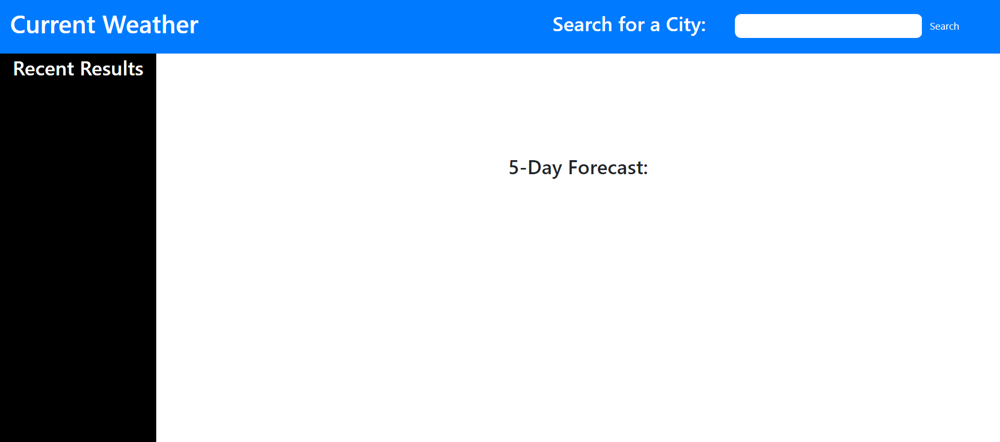
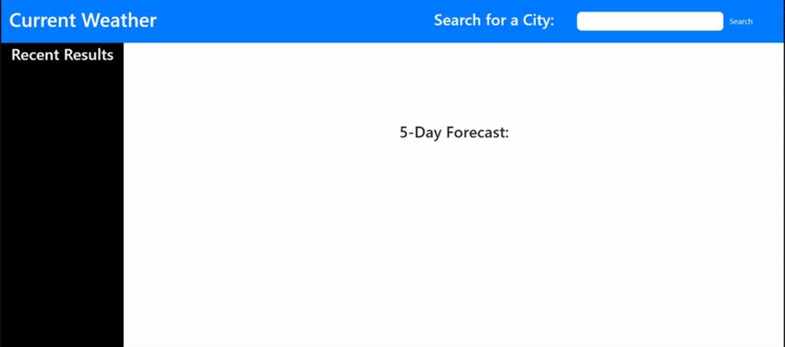
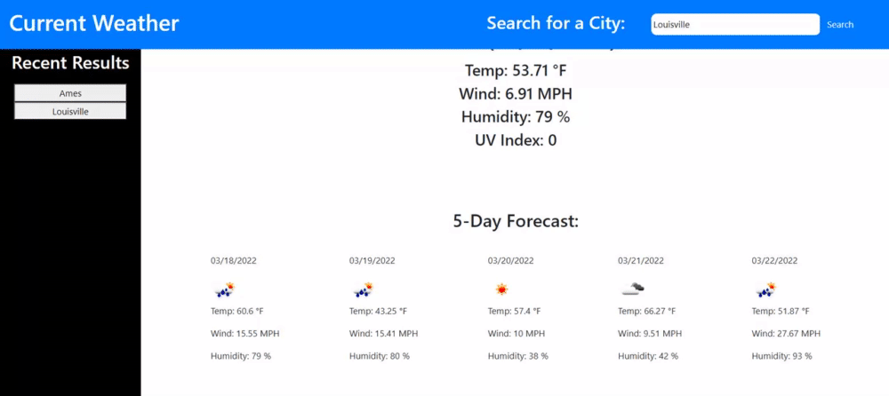

# Weather Dashboard

## Table of Contents
- [Description](#description)
- [Visuals](#visuals)
- [Links](#links)

## Description

This is a weather dashboard that uses OpenWeatherMap api and local storage to access weather and forecast for the location you search.

## Visuals

## Links

Deployed site: https://buggiess.github.io/weather-dashboard/
